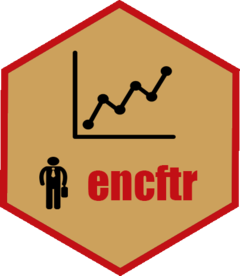

<!-- README.md is generated from README.Rmd. Please edit that file -->

# encftr 

<!-- badges: start -->

[](https://www.repostatus.org/#wip)
[](https://www.tidyverse.org/lifecycle/#experimental)
[](https://github.com/endomer-py/encftr/actions)
[](https://codecov.io/gh/endomer-py/encftr?branch=master)
[](https://CRAN.R-project.org/package=encftr)
<!-- badges: end -->

`encftr` es una interfaz para trabajar con la base de datos de la
Encuesta Nacional Continua de Fuerza de Trabajo (ENCFT) en R.

## Instalación

`encftr` aun no está en CRAN.

<!-- You can install the released version of encftr from [CRAN](https://CRAN.R-project.org) with: -->
<!-- ``` r -->
<!-- install.packages("encftr") -->
<!-- ``` -->

Pero puedes instalar la versión de desarrollo desde
[GitHub](https://github.com/) con:

``` r
tryCatch(
  library(remotes),
  error = function(e){
    install.packages('remotes')
  }
)
remotes::install_github("endomer-py/encftr")
```

## Roadmap

1.  Completar el diccionario.

  <svg width="50%" height="25" xmlns="http://www.w3.org/2000/svg" style="display: block; margin: auto;">
  <linearGradient id="a" x2="0" y2="100%">
    <stop offset="0" stop-color="#bbb" stop-opacity="0.2"/>
  <stop offset="1" stop-opacity="0.1"/>
    </linearGradient>
    <rect rx="4" x="0" width="50%" height="25" fill="#555"/>
    <rect rx="4" x="0" width="309%" height="25" fill="#5cb85c"/>
    <rect rx="4" width="50%" height="25" fill="url(#a)"/>
    <g fill="#fff" text-anchor="middle" font-family=DejaVu Sans,Verdana,Geneva,sans-serif font-size="14">
    <text x="154%" y="17.5">618626</text>
    </g>
    </svg>
    

2.  Agregar una función para calcular la pobreza monetaria.
3.  Agregar una función para el cálculo del ICV.
4.  Agregar validadores a las funciones para garantizar que las
    variables son del tipo y con el contenido esperado en los cálculos.
5.  Escribir tests
6.  Hacer que todas las funciones trabajen con conexiones a base de
    datos (Las que usan cut3 específicamente).

## Contribuye

Tienes comentarios o quieres contribuir?

Por favor, revisa las [gias de contribución (en
inglés)](https://endomer-py.github.io/encftr/CONTRIBUTING.html).

Ten en cuenta que el proyecto `encftr` está sujeto a un [Código del
contribuyente](https://contributor-covenant.org/es/version/2/0/CODE_OF_CONDUCT.html).
Contribuyendo con el proyecto aceptas los términos y condiciones.

<hr/>

<a href="./articles/encftr.html">
  <svg width="50%" height="30" xmlns="http://www.w3.org/2000/svg" style="display: block; margin: auto;">
  <linearGradient id="a" x2="0" y2="100%">
    <stop offset="0" stop-color="#bbb" stop-opacity="0.2"/>
  <stop offset="1" stop-opacity="0.1"/>
    </linearGradient>
    <rect rx="4" x="0" width="50%" height="30" fill="#555"/>
    <rect rx="4" x="0" width="50%" height="30" fill="#00a65a"/>
    <rect rx="4" width="50%" height="30" fill="url(#a)"/>
    <g fill="#fff" text-anchor="middle" font-size="18">
    <text x="25%" y="21">Guía de inicio rápido</text>
    </g>
    </svg>
    </a>
